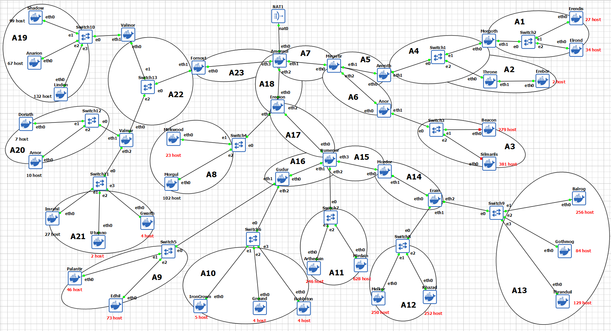
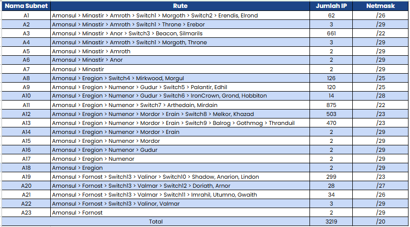
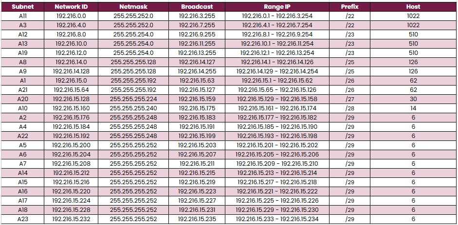
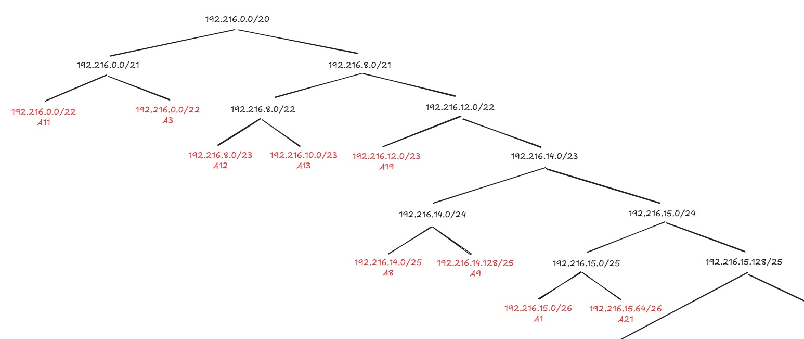
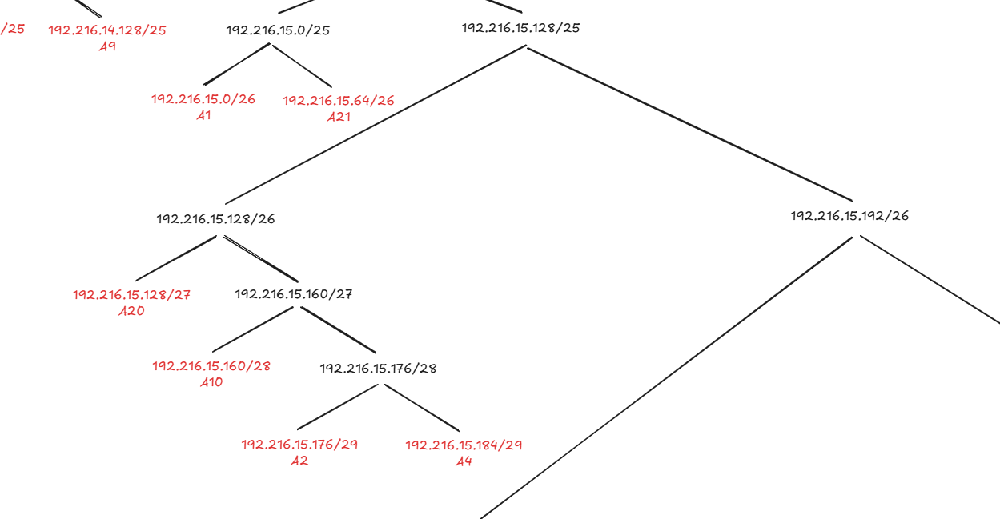
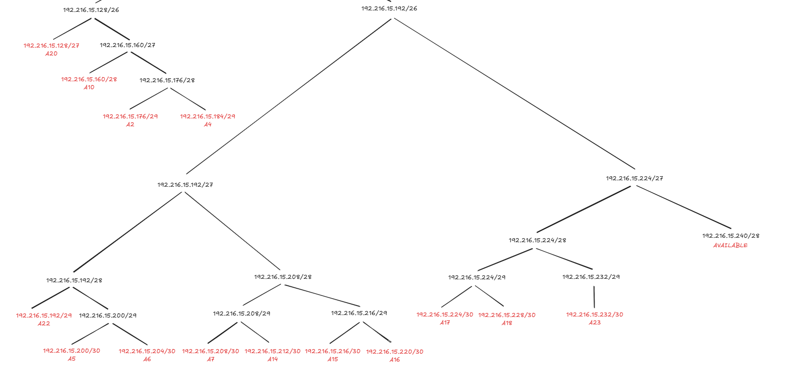

# Jarkom-Modul-4-2025-K10
## Anggota Kelompok 10
| Nama                      | NRP        | Pembagian |
| --------------------------| ---------- | --------- |
| Bayu Kurniawan            | 5027241055 | CPT CIDR  |
| Ica Zika Hamizah          | 5027241058 | GNS VLSM  |

### GNS VLSM 

Pertama buat topologi sesuai soal di GNS, agar memudahkan pengerjaan, tandai setiap subnet dan beri nama seperti A1, A2, dll. Dalam topologi dibawah ini terdapat 23 subnet.

Berikut daftar rute sesuai subnetnya

#### Menentukan base network

Karena prefix IP-nya `192.216`, maka base-nya adalah `192.216.0.0`. Total kebutuhan host adalah 3219, maka prefixnya `/20`.
Maka base networknya adalah `192.216.0.0/20`.

Berikut hasil akhir kebutuhan host dan pembagian IP-nya bisa dilihat dibawah ini.

#### Persebaran IP

Untuk memudahkan pembagian dan perhitungan, buat pohon untuk persebaran IP-nya, dimulai dari prefix atas yakni `/20`

Urutkan dari Terbesar, aturan wajib VLSM: Semua kebutuhan subnet harus diurutkan dari yang terbesar ke yang terkecil. Pastikan blok IP terbesar (seperti `/22`) mendapatkan "ruang" terlebih dahulu sebelum bloknya dipecah-pecah oleh subnet yang lebih kecil. Urutannya adalah:
- A11 (875 host -> butuh blok 1024 IP / `/22`)
- A3 (661 host -> butuh blok 1024 IP / `/22`)
- A12 (503 host -> butuh blok 512 IP / `/23`)
- A13 (470 host -> butuh blok 512 IP / `/23`)
- A19 (299 host -> butuh blok 512 IP / `/23`)
- ...dan seterusnya hingga subnet terkecil (/29 dan `/30`)

#### Proses Alokasi

Mulai mengalokasikan IP secara berurutan dari daftar yang sudah diurutkan tadi:

1. Alokasi untuk A11 (`/22`):

- Ambil IP pertama yang tersedia: `192.216.0.0`

- Hasil A11: Network `192.216.0.0`, Broadcast `192.216.3.255`

2. Alokasi untuk A3 (`/22`):

- Ambil IP berikutnya setelah broadcast A11 (yaitu ...3.255): `192.216.4.0`

- Hasil A3: Network `192.216.4.0`, Broadcast `192.216.7.255`

3. Alokasi untuk A12 (`/23`):

- Ambil IP berikutnya setelah broadcast A3: `192.216.8.0`

- Hasil A12: Network `192.216.8.0`, Broadcast `192.216.9.255`

4. Alokasi untuk A13 (`/23`):

- Ambil IP berikutnya: `192.216.10.0`

- Hasil A13: Network `192.216.10.0`, Broadcast `192.216.11.255`

5. Alokasi untuk A19 (`/23`):

- Ambil IP berikutnya: `192.216.12.0`

- Hasil A19: Network `192.216.12.0`, Broadcast `192.216.13.255`

6. Proses ini dilanjutkan terus. IP berikutnya yang tersedia adalah `192.216.14.0`.

#### Mengisi sisa (subnet kecil)

Blok IP sisa (dimulai dari `192.216.14.0`) kini digunakan untuk mengalokasikan semua subnet yang lebih kecil (`/25`, `/26`, `/27`, dst.).

1. Alokasi untuk A8 (`/25`):

- Ambil IP berikutnya: `192.216.14.0`

- Hasil A8: Network `192.216.14.0`, Broadcast `192.216.14.127`

2. Alokasi untuk A9 (`/25`):

- Ambil IP berikutnya: `192.216.14.128`

- Hasil A9: Network `192.216.14.128`, Broadcast `192.216.14.255`

3. Alokasi Sisa:

- Blok sisa berikutnya (`192.216.15.0`) lalu pecah lagi untuk A1 (`/26`), lalu A21 (`/26`), lalu A20 (`/27`), dan seterusnya hingga semua subnet `/29` dan `/30` terkecil terisi.

Dengan metode ini, semua subnet berhasil dialokasikan dengan sangat efisien, hanya menyisakan 20 IP cadangan di akhir.

#### Konfigurasi

Setelah alokasi IP, bisa langsung konfigurasi setiap nodenya, script bisa di akses di directory `script`.

Berikut test ping dari beberapa sample:

`progress`